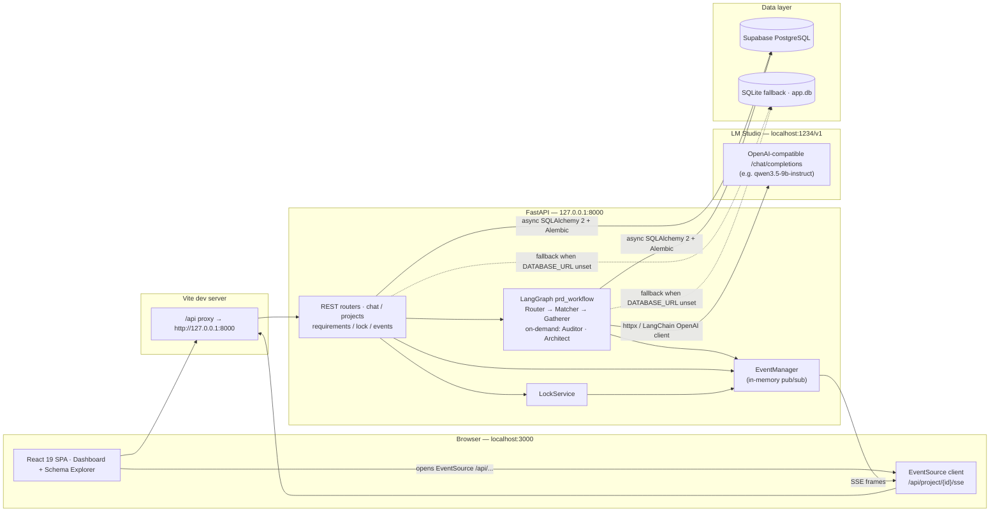

<div align="center">

# 🏦 AgenticDIA

### Enterprise Requirements Architecture Core

**Agentic, banking-grade requirements engineering** · local LLM (LM Studio) · FastAPI + LangGraph · Supabase PostgreSQL · React 19

</div>

AgenticDIA turns plain-English banking product briefs into **audited, versioned, engineering-ready requirements**. You describe a feature in the chat; a LangGraph workflow of specialist agents (Router, Matcher, Gatherer, Auditor, Architect) runs **fully locally** against a model served by [LM Studio](https://lmstudio.ai), then persists only the changes you confirm to a PostgreSQL database — with per-artifact locking along the way.

> [!IMPORTANT]
> This project **does not** use Gemini or any cloud LLM API key. All inference happens 100% locally through LM Studio. There is **no** `.env.local` and no `GEMINI_API_KEY` setup — backend configuration lives in [`backend/.env`](backend/.env.example).

---

## ✨ Features

- **Multi-agent LangGraph workflow** — `router_node`, `requirement_matcher_node`, `gatherer_node`, `auditor_node`, `architect_node` (on-demand execution driven by a persisted workflow state machine)
- **Local-first inference** — OpenAI-compatible calls to `http://localhost:1234/v1`; no API keys, no cloud dependency
- **7-point banking compliance audit** — the Auditor validates against a mandatory banking checklist and raises clarification questions when coverage is incomplete
- **Automated PRD + Mermaid diagrams** — the Architect synthesizes a full Product Requirements Document and flow diagrams
- **Version snapshot ledger** — every accepted state bump is an immutable, versioned PRD record with full history
- **Human-in-the-loop** — LLM changes are staged as *pending actions*; you confirm or cancel before anything is written to the database
- **Generic artifact locking** — lock/unlock projects, epics, requirements, user stories, acceptance criteria, clarification questions, and PRD documents; optimistic UI with automatic rollback
- **Real-time updates** — Server-Sent Events push state changes to the dashboard instead of polling
- **LM Studio health check & graceful degradation** — the backend probes the local gateway at startup and on every `/api/health` call; the chat header shows an **LLM Offline** pill when the local server is down (auto-refreshing, no restart needed) instead of failing with opaque 503s (Finding #40)
- **In-app Postgres Schema Explorer** — DDL / table explorer rendered from the live [`backend/init.sql`](backend/init.sql)

---

## 🧱 Architecture



**Control flow.** The Vite dev server proxies every `/api/*` request (including the SSE stream) to FastAPI on port 8000. The chat / requirements routers feed a user message into the compiled LangGraph graph. Each agent node calls the local LM Studio model, and state is persisted through async SQLAlchemy into PostgreSQL. Any mutation publishes an event on the in-memory bus, which the EventManager streams back to the browser over SSE so the dashboard refreshes automatically.
## 🧰 Tech Stack

| Layer | Technology |
|-------|-----------|
| Frontend | React 19 · TypeScript · Vite 6 · Tailwind CSS 4 · Motion · lucide-react · axios · docx |
| Backend | Python 3.12+ (developed on 3.14) · FastAPI · uvicorn · SQLAlchemy 2 (async) · Alembic · Pydantic v2 |
| AI orchestration | LangGraph · LangChain · LangChain-OpenAI client (pointed at LM Studio) |
| Inference | **LM Studio** — local OpenAI-compatible server (`http://localhost:1234/v1`), e.g. `qwen3.5-9b-instruct` |
| Database | Supabase PostgreSQL (transaction pooler compatible) · SQLite fallback via `sqlite+aiosqlite:///app.db` |
| Realtime | Server-Sent Events (SSE) over FastAPI `StreamingResponse` |

## 📁 Project Structure

```
agenticdia/
├── index.html                  # Vite entry HTML
├── package.json                # npm scripts: dev / build / preview / lint / clean
├── vite.config.ts              # React + Tailwind plugins, /api proxy → :8000
├── tsconfig.json
├── src/
│   ├── main.tsx                # React root
│   ├── App.tsx                 # Agent workspace ↔ Schema Explorer shell
│   ├── index.css
│   ├── data.ts                 # Initial datasets + table schemas for Explorer
│   └── components/
│       ├── Dashboard.tsx       # Multi-agent requirements workspace (SSE, locks, PRD)
│       ├── ConfirmationPanel.tsx
│       └── Toast.tsx
├── backend/
│   ├── .env.example            # ← copy to backend/.env
│   ├── requirements.txt        # Python dependencies
│   ├── alembic.ini
│   ├── alembic/                # Versioned migrations (0001 initial, 0002 rename)
│   ├── init.sql                # Full PostgreSQL DDL (drives the Schema Explorer)
│   ├── test_sse.py             # End-to-end SSE stream test
│   ├── tests/                  # pytest unit tests (merge service, etc.)
│   └── app/
│       ├── main.py             # FastAPI app, CORS, router registration, lifespan
│       ├── config.py           # pydantic-settings (reads backend/.env)
│       ├── database.py         # Async SQLAlchemy engine / session factory
│       ├── models.py           # SQLAlchemy ORM models
│       ├── schemas.py          # Request/response Pydantic schemas
│       ├── repository.py       # Data-access layer
│       ├── migrations.py       # Startup Alembic runner + default user seed
│       ├── llm_client.py       # Direct LM Studio HTTP client (strict JSON mode)
│       ├── llm_utils.py        # Structured-output helpers
│       ├── agents.py           # LangGraph nodes + compiled prd_workflow graph
│       ├── semantic_service.py # Workflow router / intent / matcher agents
│       ├── merge_service.py    # User story reconciliation (unit-testable core)
│       ├── lock_service.py     # Generic artifact lock/unlock engine
│       ├── event_manager.py    # In-memory SSE pub/sub
│       ├── prompt_loader.py    # Loads prompts from app/prompts/*.md
│       ├── prompts/            # gatherer / auditor / architect / router / matcher / ...
│       └── routes/             # chat.py projects.py requirements.py lock.py events.py
└── venv/                       # Local Python virtual environment
```

---

## 🚀 Getting Started

### Prerequisites

- **Node.js 20+** and npm
- **Python 3.12+** (the bundled `venv/` targets 3.14)
- **LM Studio** (desktop app) — for local inference
- Optional: a **Supabase** PostgreSQL project (the backend works without one via the SQLite fallback)

### 1. Install frontend dependencies

```bash
npm install
```

### 2. Create and activate the Python environment

```bash
python3 -m venv venv
source venv/bin/activate
pip install -r backend/requirements.txt
```

> If you already have the bundled `venv/`, just `source venv/bin/activate`.

### 3. Configure the backend — `backend/.env`

Backend settings are loaded by [pydantic-settings](backend/app/config.py) from **`backend/.env`** — there is no root `.env.local`.

```bash
cp backend/.env.example backend/.env
```

Then edit the two things that matter:

- **`DATABASE_URL`** — point it at your Supabase Postgres, e.g.
  `postgresql://postgres.<ref>:<password>@aws-0-ap-southeast-1.pooler.supabase.com:6543/postgres`.
  If you leave it unset (or empty), the backend automatically falls back to a local SQLite file `backend/app.db`.
- **`LM_STUDIO_MODEL_FALLBACK`** — must match a model you have loaded in LM Studio.

### 4. Start LM Studio

1. Open **LM Studio** and load a chat model (e.g. `qwen3.5-9b-instruct`).
2. Go to the **Developer / Local Server** tab and click **Start Server** (it listens on `http://localhost:1234/v1`).
3. Keep the window open while you use the app.

### 5. Run the app

```bash
npm run dev
```

This single command starts **both** processes:

| Process | Command | URL |
|---------|---------|-----|
| Backend (FastAPI) | `cd backend && python3 -m uvicorn app.main:app --host 127.0.0.1 --port 8000` | `http://127.0.0.1:8000` |
| Frontend (Vite) | `vite --port=3000 --host=0.0.0.0` | `http://localhost:3000` |

Vite proxies `/api/*` → `http://127.0.0.1:8000`, so the SPA never needs a hardcoded API URL.

### 6. Verify it is healthy

```bash
curl http://localhost:8000/api/health
```

Expect a JSON response naming the app, the LM Studio gateway, and the context budget. Interactive Swagger docs are available at **http://localhost:8000/docs**.

> [!NOTE]
> **Since Finding #40 was fixed, `/api/health` is a real readiness probe.** In addition to the app metadata it runs a TTL-cached `GET /models` round-trip against LM Studio and reports:
>
> - `lm_studio_online` — `true` when the local server answered the probe
> - `lm_studio_model` / `lm_studio_model_loaded` — the configured `LM_STUDIO_MODEL_FALLBACK` and whether it is currently loaded
> - `lm_studio_loaded_models` / `lm_studio_latency_ms` — everything the gateway serves and the probe latency
> - `lm_studio_error` / `lm_studio_last_checked` — failure reason (if any) and probe timestamp
>
> When LM Studio is **offline** the app still answers `200` with `lm_studio_online: false`
> and a human-readable `lm_studio_error` — so uptime checks keep working while the
> chat header surfaces the status via an **LLM Offline** pill instead of opaque 503s.
>
> `npm run dev` backgrounds the backend with `&`, so both logs interleave in one terminal. To run them separately, start the backend with `source venv/bin/activate && cd backend && uvicorn app.main:app --port 8000` in one terminal and `npx vite --port=3000` in another.

---

## ⚙️ Environment Variables

All backend configuration lives in `backend/.env`. Unlisted keys such as `GEMINI_API_KEY` or `APP_URL` are **legacy/no-ops** — ignored by the current codebase.

| Variable | Default | Description |
|----------|---------|-------------|
| `LM_STUDIO_URL` | `http://localhost:1234/v1` | Base URL of the LM Studio OpenAI-compatible server |
| `LM_STUDIO_API_KEY` | `lm-studio` | Bearer token sent to LM Studio (any value is accepted locally) |
| `LM_STUDIO_MODEL_FALLBACK` | `qwen3.5-9b-instruct` | Model id used in every request; must match a model loaded in LM Studio |
| `DATABASE_URL` | *(empty → SQLite `backend/app.db`)* | PostgreSQL URL. `postgres://` → `postgresql+asyncpg://`; `ssl=require` auto-appended for `supabase.com` hosts |
| `CORS_ORIGINS` | `http://localhost:3000,http://127.0.0.1:3000` | Comma-separated browser origins allowed by CORS |
| `MAX_CONTEXT_TOKENS` | `8192` | Total context budget injected into every system prompt (MacBook-memory-safe); incoming `/api/chat` and workflow payloads exceeding this limit are rejected with HTTP 413 | 
| `TEMPERATURE` | `0.0` | Sampling temperature for all agent calls |
| `RATE_LIMIT_ENABLED` | `true` | Master switch for in-process sliding-window rate limiting on LLM-facing endpoints |
| `RATE_LIMIT_CHAT_LIMIT` / `RATE_LIMIT_CHAT_WINDOW` | `30` / `60` | Max `/api/chat` requests per client IP per window (seconds) |
| `RATE_LIMIT_WORKFLOW_LIMIT` / `RATE_LIMIT_WORKFLOW_WINDOW` | `20` / `60` | Max workflow-endpoint requests (`process-requirements`, `workflow-router`, `intent-detector`, `requirement-matcher`) per client IP per window (seconds) |
| `DEBUG` | `false` | Enables uvicorn `--reload` and SQL echo |
| `APP_NAME` | `Enterprise Requirements Architecture Core` | Display name used in health/docs |
---

## 🤖 Multi-Agent Pipeline

The backend compiles a LangGraph state machine (`prd_workflow`) in [`backend/app/agents.py`](backend/app/agents.py). Each node runs prompts from [`backend/app/prompts/`](backend/app/prompts) and returns structured JSON.

Agents run **on-demand** — one `POST /api/process-requirements` call executes a single `target_agent`. Progress from gathering → audit → architecture is advanced by the workflow **state machine** (`IDLE → GATHERING → REVIEWING → AUDITING → WAITING_CLARIFICATION → ARCHITECTING → COMPLETED`), which the endpoint updates on each call rather than through one long-lived graph chain.


In a normal requirement pass the map is: **Router → Matcher → Gatherer** (producing stories) in the `GATHERING` state; a separate **Auditor** run in the `AUDITING` state; and a separate **Architect** run in the `ARCHITECTING` state — each advancing the state machine.

| Node | Role |
|------|------|
| **router_node** | Classifies each message as `CHAT`, `QUESTION`, `COMMAND`, or `REQUIREMENT` (with heuristic fallback). |
| **requirement_matcher_node** | Maps the message to existing user stories (e.g. `US-001`) and proposes `NEW / UPDATE / DELETE / CLARIFY` via `requirement-matcher` + semantic change detection. |
| **gatherer_node** | Parses the requirement text into structured **user stories + acceptance criteria**; reconciles them against previously persisted stories (create / update / archive / unchanged) using the merge service. |
| **auditor_node** | Runs the **7-point banking compliance checklist** over changed stories, marks validation status, and emits clarification questions for anything ambiguous or non-compliant. |
| **architect_node** | Synthesizes the final **PRD markdown** and a **Mermaid diagram** from the audited state. |
| **delete_requirement_node** | Handles `DELETE_REQUIREMENT` intent to archive/remove a requirement. |

> **Workflow state machine** — the endpoint tracks `current_workflow_state` per project:
>
> ```
> IDLE → GATHERING → REVIEWING → AUDITING → WAITING_CLARIFICATION → ARCHITECTING → COMPLETED
> ```
>
> The Gatherer only fires in `GATHERING`/`REVIEWING`; the **Auditor** fires when you run it (or when reassessing clarification answers) in `AUDITING`; the **Architect** fires on *Generate PRD* in `ARCHITECTING`. Locked artifacts are excluded from LLM evaluation and from the merge, so a locked requirement can never be silently rewritten by an agent.

## 🖱️ Using the App

1. Open **http://localhost:3000**.
2. In the **Agent Workspace**, create a project (or pick the seeded one).
3. Type a feature brief in the chat (e.g. *"Add a PromptPay real-time merchant settlement flow"*). The Router + Matcher classify it and the **Gatherer** produces user stories. Then run the **Auditor** to validate compliance and **Generate PRD** to have the Architect draft the document.
4. Review the result in the **ConfirmationPanel** — accept (`confirm`) or reject (`cancel`).
5. Use the **lock** buttons on any artifact to freeze it. The Schema Explorer tab visualizes the live PostgreSQL schema.

## 🔒 Human-in-the-Loop & Locking

- **Pending actions:** every substantive AI change is persisted as a `pending_actions` row with `status = WAITING_CONFIRMATION`. Nothing is applied until you call the confirm endpoint.
- **Confirm / cancel:** `POST /api/confirm-action/{action_id}` applies the staged `proposed_changes` to `requirement_states` and deletes the action; `POST /api/cancel-action/{action_id}` discards it.
- **Generic locks:** any supported artifact can be locked/unlocked via the generic endpoints. The UI applies **optimistic** lock updates with automatic rollback if the API call fails.

## ⚡ Real-Time Updates (SSE)

Instead of polling, the dashboard opens an `EventSource` on `/api/project/{id}/sse`. The backend's in-memory `EventManager` publishes an event on every mutation and streams `{"event": ..., "data": {...}}` frames (with `: ping` heartbeats every 15 s) to connected clients. The frontend refreshes project state once per event.
---

## 📡 API Reference

The backend is a FastAPI app; full interactive documentation (with request/response schemas) is auto-generated at **`http://localhost:8000/docs`** (Swagger UI) and **`/redoc`**. All endpoints are under `/api` and are proxied by Vite on port 3000.

### Health & Chat

| Method | Path | Description |
|--------|------|-------------|
| `GET` | `/api/health` | Liveness + LM Studio readiness; returns app name, gateway, context budget, and a live `/models` probe (`lm_studio_online`, latency, loaded models, error) |
| `POST` | `/api/chat` | General chat with optional `project_id`; persists messages and emits a `chat_reply` SSE event |

### Projects

| Method | Path | Description |
|--------|------|-------------|
| `GET` | `/api/projects` | List all projects |
| `POST` | `/api/projects` | Create a project (`ProjectCreate`: `name`, `description`, `industry_standard`) |
| `PUT` | `/api/projects/{project_id}` | Rename / update a project |
| `DELETE` | `/api/projects/{project_id}` | Delete a project |
| `GET` | `/api/project/{project_id}` | Load the centralized **requirement state** (or defaults if none exists) |
| `PUT` | `/api/project/{project_id}` | Directly persist manual edits to the requirement state (e.g. PRD edits) |
| `GET` | `/api/project/{project_id}/conversations` | Conversation history for the project |

### Requirements

| Method | Path | Description |
|--------|------|-------------|
| `GET` | `/api/project/{project_id}/requirements` | All requirements incl. lock status |
| `GET` | `/api/project/{project_id}/requirements/{requirement_id}` | Single requirement |
| `POST` | `/api/project/{project_id}/requirements/{requirement_id}/lock` | Lock a requirement |
| `POST` | `/api/project/{project_id}/requirements/{requirement_id}/unlock` | Unlock a requirement |

### Multi-Agent & Semantic

| Method | Path | Description |
|--------|------|-------------|
| `POST` | `/api/process-requirements` | Run the full LangGraph pipeline (`ProcessRequirementsRequest`); returns routed workflow, detected intent, structured requirements, audit result, PRD + diagram, and a pending-action id |
| `POST` | `/api/workflow-router` | Classify a message → `CHAT / QUESTION / COMMAND / REQUIREMENT` |
| `POST` | `/api/intent-detector` | Detect intent → `GENERAL_CHAT` or `REQUIREMENT_REQUEST` |
| `POST` | `/api/requirement-matcher` | Match a message to an existing story and recommend `NEW / UPDATE / DELETE / CLARIFY` |
| `POST` | `/api/audit/respond/{question_id}` | Submit a stakeholder answer to close a clarification question |
| `POST` | `/api/clarification/submit` | Submit clarification answers (`{project_id, answers}`), re-run the Auditor, and update workflow state |

### PRD & Versioning

| Method | Path | Description |
|--------|------|-------------|
| `POST` | `/api/prd/export/{project_id}` | Generate and persist a new immutable PRD version |
| `GET` | `/api/project/{project_id}/prd-versions` | List all PRD versions |
| `GET` | `/api/project/{project_id}/prd-versions/latest` | Latest PRD version |
| `GET` | `/api/project/{project_id}/prd-versions/{version_number}` | A specific PRD version |

### Locking & Pending Actions

| Method | Path | Description |
|--------|------|-------------|
| `POST` | `/api/project/{project_id}/artifacts/{artifact_type}/{artifact_id}/lock` | Generic lock. `artifact_type ∈ {project, epic, requirement, user_story, acceptance_criteria, clarification_question, prd_document}`; body `{locked_by?, lock_reason?}` |
| `POST` | `/api/project/{project_id}/artifacts/{artifact_type}/{artifact_id}/unlock` | Generic unlock (same body) |
| `GET` | `/api/project/{project_id}/artifacts/{artifact_type}/{artifact_id}/lock-status` | Read lock metadata (`is_locked`, `locked_by`, `locked_at`, `lock_reason`) |
| `GET` | `/api/pending-actions/{project_id}` | List pending actions awaiting confirmation |
| `POST` | `/api/confirm-action/{action_id}?project_id=...` | Apply a staged AI change to the database |
| `POST` | `/api/cancel-action/{action_id}?project_id=...` | Discard a staged AI change |

### Events & Audit Log

| Method | Path | Description |
|--------|------|-------------|
| `GET` | `/api/events` | Recent artifact event log entries across all projects |
| `GET` | `/api/events/{artifact_type}/{artifact_id}` | Event history for one artifact |
| `GET` | `/api/events/action/{action}` | Events of a given action (`CREATE, UPDATE, DELETE, ARCHIVE, LOCK, UNLOCK`) |
| `GET` | `/api/project/{project_id}/events` | Events within a project (optional `artifact_type`, `action` filters) |
| `GET` | `/api/project/{project_id}/sse` | **Server-Sent Events** stream (push updates) |

### Example — run the multi-agent pipeline

```bash
curl -X POST http://localhost:3000/api/process-requirements \
  -H "Content-Type: application/json" \
  -d '{
    "project_id": "00000000-0000-0000-0000-000000000000",
    "raw_input": "Add a PromptPay QR settlement flow with instant notifications and reconcile at end of day.",
    "current_version": 1,
    "target_agent": "gatherer"
  }'
```

### Example — confirm a staged AI change

```bash
curl -X POST "http://localhost:3000/api/confirm-action/<action-id>?project_id=00000000-0000-0000-0000-000000000000"
```
---

## 🗄️ Database Schema

Tables are provisioned by **Alembic migrations that run automatically at backend startup** (see [`backend/app/migrations.py`](backend/app/migrations.py)). The full PostgreSQL reference DDL lives in [`backend/init.sql`](backend/init.sql) and drives the in-app Schema Explorer.

| Table | Purpose |
|-------|---------|
| `users` | Stakeholders, product owners, analysts, auditor; default system user is seeded on startup |
| `projects` | Banking systems / products under review; carries lock metadata |
| `epics` | High-level functional domains per project |
| `requirements` | Individual requirement records (lock metadata incl. `is_locked`) |
| `user_stories` | Structured `As a … I want … so that …` stories + ticket codes (`US-001`) |
| `acceptance_criteria` | Gherkin-style criteria per story |
| `audit_results` | Compliance audit snapshots (`is_valid`, `passed/failed_checks`) |
| `clarification_questions` | Open compliance questions and resolution answers |
| `prd_documents` / `prd_versions` | Generated PRD records; immutable versioned snapshots |
| `version_history` | Requirement-state version history |
| `requirement_states` | Centralized per-project JSON state (created by migrations) |
| `pending_actions` | Human-in-the-loop staged changes (created by migrations) |
| `conversation_messages` | Persistent chat history per project |
| `artifact_event_logs` | **Append-only** audit trail of `CREATE / UPDATE / DELETE / ARCHIVE / LOCK / UNLOCK` |

> **Supabase note:** the engine targets the transaction pooler (port `6543`), uses minimal SQLAlchemy pooling, `pool_pre_ping`, and disables the statement cache for PgBouncer compatibility. On SQLite fallback, the GUID type degrades to `CHAR(36)`.

---

## 🧪 Testing

```bash
# Frontend type-check (tsc --noEmit)
npm run lint

# Backend unit tests (pytest)
cd backend && python -m pytest tests/

# SSE end-to-end stream test (runs against the real StreamingResponse generator)
cd backend && python test_sse.py

# Production build (emits static assets into dist/)
npm run build
```

> `npm run preview` serves the built SPA with `vite preview`. Note that the `/api` **proxy is only configured for the dev server** (`server.proxy`), so in production you must proxy `/api` → `127.0.0.1:8000` yourself (or host the SPA from FastAPI).

---

## 🛠️ Troubleshooting

| Symptom | Fix |
|---------|-----|
| `503 Inference gateway unavailable` (or 502) | LM Studio is not running or its server is off. Start the **Developer / Local Server** on `localhost:1234` and load a model. |
| **“LLM Offline” pill in the chat header** | Finding #40: the app no longer assumes the LLM is up — start LM Studio's Local Server on `localhost:1234` and load `LM_STUDIO_MODEL_FALLBACK`; the pill switches back to Idle automatically (20s poll or tab focus). |
| 404 `/chat/completions` from LM Studio | The local server URL must be the OpenAI-compatible **`/v1`** endpoint — keep `LM_STUDIO_URL="http://localhost:1234/v1"`. |
| Model "not found" error | Set `LM_STUDIO_MODEL_FALLBACK` to the exact model id shown in LM Studio, and load that model before loading the app. |
| Slow first response | Local models warm up on first call and may need to load into VRAM/RAM; subsequent calls are faster. |
| CORS errors in the browser | Make sure `CORS_ORIGINS` in `backend/.env` includes `http://localhost:3000`. |
| SQLite table errors after switching DBs | Delete `backend/app.db` (and rerun) when toggling between SQLite and Postgres; migrations run on startup. |
| Port already in use | `8000` (backend) or `3000` (vite) may be occupied; stop the other process or change ports in `package.json`. |

---

## 🔐 Security Notes

- **Local-only inference:** prompts for both chat and multi-agent flow are sent to your local LM Studio instance — nothing leaves your machine to an LLM provider.
- **No auth layer yet:** projects currently default to the seeded system user (`00000000-0000-0000-0000-000000000000`). Suitable for local/enterprise demo use; add authentication before any public deployment.
- **Append-only audit log:** `artifact_event_logs` intentionally stores no foreign keys and is never updated/deleted — it exists purely for traceability.
- **Lock enforcement** is server-side (`LockService`), not just UI-based: locked artifacts raise `409 Conflict` on mutation attempts.
