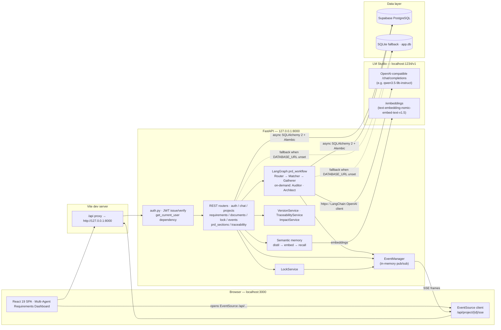
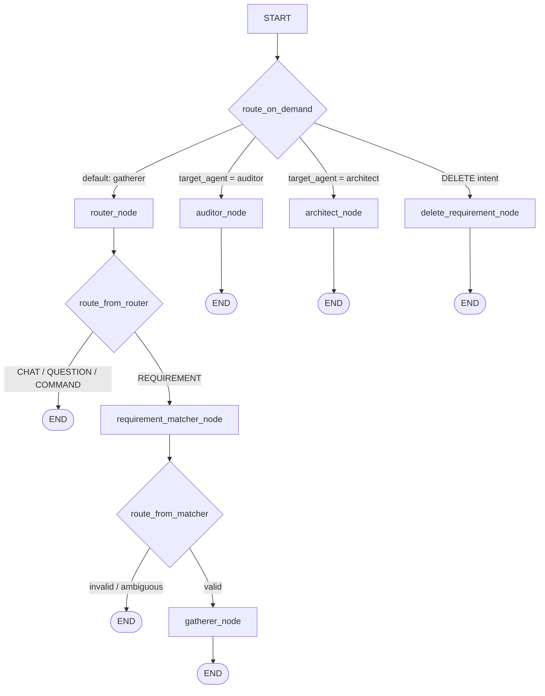

<div align="center">

# Agentic AI

### Enterprise Requirements Architecture Core

**Agentic, banking-grade requirements engineering** · local LLM (LM Studio) · FastAPI + LangGraph · Supabase PostgreSQL · React 19

</div>

Agentic AI turns plain-English banking product briefs into **audited, versioned, engineering-ready requirements**. You sign in, describe a feature in the chat — or upload an existing brief / BRD document (DOCX, PDF, Markdown, TXT) into the project's knowledge base; a LangGraph workflow of specialist agents (Router, Matcher, Gatherer, Auditor, Architect) runs **fully locally** against a model served by [LM Studio](https://lmstudio.ai), then persists only the changes you confirm to a PostgreSQL database — with per-artifact locking along the way. A per-project **semantic memory** layer keeps durable decisions recallable across sessions, and a derived **traceability matrix** proves every requirement is covered by stories, criteria, PRD sections, and diagrams.

> [!IMPORTANT]
> This project **does not** use Gemini or any cloud LLM API key. All inference happens 100% locally through LM Studio. There is **no** `.env.local` and no `GEMINI_API_KEY` setup — backend configuration lives in [`backend/.env`](backend/.env.example).

---

## Features

- **Multi-agent LangGraph workflow** — `router_node`, `requirement_matcher_node`, `gatherer_node`, `auditor_node`, `architect_node` (on-demand execution driven by a persisted workflow state machine)
- **Local-first inference** — OpenAI-compatible calls to `http://localhost:1234/v1`; no API keys, no cloud dependency
- **7-point banking compliance audit** — the Auditor validates against a mandatory banking checklist and raises clarification questions when coverage is incomplete
- **Automated PRD + Mermaid diagrams** — the Architect synthesizes a full Product Requirements Document and flow diagrams
- **Document knowledge base & extraction** — upload DOCX / PDF / Markdown / TXT briefs (≤ `MAX_UPLOAD_MB`); they are converted to canonical markdown, then an explicit, user-triggered extraction feeds them through the Gatherer (one pass, or chunked passes with overlap, single-tokenized chunking, and bounded concurrency up to `DOCUMENT_EXTRACTION_CONCURRENCY`) into a **single staged pending action** — nothing is written until you confirm. Live chunk progress streams over SSE (`chunk X/N`) without extra project-state downloads
- **Server-side PRD export** — the generated LaTeX PRD (`template-krungsrinimble.tex`) downloads as **DOCX** (native `python-docx` renderer) and **PDF** (headless LibreOffice, with a Tectonic fallback), so PDF and Word output always match
- **Version snapshot ledger** — every accepted state bump is an immutable, versioned PRD record (integer `version` + display `semver`) with line-level diffs against any earlier version and append-only restore
- **Human-in-the-loop** — LLM changes are staged as *pending actions*; you confirm or cancel before anything is written to the database
- **Workflow Stop button** — an in-flight `process-requirements` run can be cancelled server-side (`POST /api/process-requirements/cancel`); partial work is discarded, never persisted
- **Generic artifact locking** — lock/unlock projects, epics, requirements, user stories, acceptance criteria, clarification questions, PRD documents, and individual PRD sections; optimistic UI with automatic rollback
- **Real-time updates** — Server-Sent Events push state changes to the dashboard instead of polling
- **Rate limiting** — in-process sliding-window limiter guards the LLM-facing endpoints (chat, workflow, document extraction) with per-IP 429s (Finding #39)
- **LM Studio health check & graceful degradation** — the backend probes the local gateway at startup and on every `/api/health` call; the chat header shows an **LLM Offline** pill when the local server is down (auto-refreshing, no restart needed) instead of failing with opaque 503s (Finding #40)
- **JWT authentication & role-based accounts** — self-service sign-up (`SIGNUP_ENABLED`, canonical roles only), `POST /api/auth/login` (OAuth2 password flow), `/api/auth/me`, password change, and bcrypt-hashed credentials stored in `users.password_hash`; projects are **scoped to the signed-in owner**, so each account sees only its own workspace
- **Semantic memory across sessions** — after every chat turn a small LLM pass distils durable facts/decisions ("project requires SSO"), embeds them via the local `LM_STUDIO_EMBEDDING_MODEL`, and stores them in `semantic_memories`; later turns recall the top-k by blended cosine relevance + recency decay (hard-capped at `MEMORY_CONTEXT_MAX_TOKENS`) — entirely **fail-open**, so memory can never break a chat turn
- **Requirement Traceability Matrix** — derived, read-only view linking Requirements ↔ User Stories ↔ Acceptance Criteria ↔ PRD sections ↔ diagrams, with a project-wide coverage/gap report
- **Impact analysis before you confirm** — `GET /api/pending-actions/{action_id}/impact` predicts what a staged change touches (stories, PRD sections, diagrams) so reviewers see *what changes* and *what is affected*, including `DANGLING` references to non-existent `REQ-`/`US-` codes
- **Part-level PRD editing & versioning** — a PRD is stored as nine independently editable, lockable, versioned parts (`prd_sections` / `prd_section_versions`); human-owned sections (`ai_generatable=false`) and locked parts survive every AI regeneration untouched, and per-part reverts append a new version instead of rewriting history

---

## Architecture



**Control flow.** The Vite dev server proxies every `/api/*` request (including the SSE stream) to FastAPI on port 8000. Requests are authenticated first (`Authorization: Bearer <jwt>`, resolved against the `users` table) and project-scoped to the owner. The chat / requirements routers feed a user message into the compiled LangGraph graph. Each agent node calls the local LM Studio model, and state is persisted through async SQLAlchemy into PostgreSQL. Before the prompt is built, the **semantic memory** layer recalls relevant project facts; after the turn it distils and embeds new ones. **VersionService**, **TraceabilityService**, and **ImpactService** sit alongside the graph as deterministic, non-LLM readers of the same tables. Any mutation publishes an event on the in-memory bus, which the EventManager streams back to the browser over SSE so the dashboard refreshes automatically.

## Tech Stack

| Layer | Technology |
|-------|-----------|
| Frontend | React 19 · TypeScript · Vite 6 · Tailwind CSS 4 · Motion · lucide-react · axios |
| Backend | Python 3.12+ (developed on 3.14) · FastAPI · uvicorn · SQLAlchemy 2 (async) · Alembic · Pydantic v2 · python-docx / pypdf / mammoth (document ingestion) · PyJWT + bcrypt (auth) |
| AI orchestration | LangGraph · LangChain · LangChain-OpenAI client (pointed at LM Studio) |
| Inference | **LM Studio** — local OpenAI-compatible server (`http://localhost:1234/v1`), e.g. `qwen3.5-9b-instruct` for chat + an embedding model for semantic memory |
| Database | Supabase PostgreSQL (transaction pooler compatible) · SQLite fallback via `sqlite+aiosqlite:///app.db` |
| Realtime | Server-Sent Events (SSE) over FastAPI `StreamingResponse` (replay-capable via `Last-Event-ID`) |

## Project Structure

```
agenticdia/
├── index.html                  # Vite entry HTML
├── package.json                # npm scripts: dev / build / preview / lint / clean / schema:*
├── vite.config.ts              # React + Tailwind plugins, /api proxy → :8000
├── tsconfig.json
├── scripts/
│   └── parse_check.ts          # tsx harness inspecting the parsed init.sql DDL
├── src/
│   ├── main.tsx                # React root
│   ├── App.tsx                 # App shell (navbar + workspace)
│   ├── index.css
│   ├── api/                    # Typed HTTP client (client.ts / types.ts / transforms.ts)
│   ├── hooks/                  # useChat · useProjects · useProjectState · useProjectSync
│   │                           # useRequirementStore · useDocuments · useArtifactLocks
│   │                           # useAuth · useModalBehavior · useLmStudioHealth · useWorkspaceUi
│   ├── schema/                 # DDL parser (npm run schema:parse self-check tool)
│   ├── utils/                  # markdown helpers
│   └── components/
│       ├── Dashboard.tsx       # Multi-agent requirements workspace (SSE, locks, PRD)
│       ├── ProjectsDashboard.tsx # Cross-project overview (pins, flags, status)
│       ├── ChatPanel.tsx       # Agent chat · LLM-health pill · Stop button
│       ├── ChatEmptyState.tsx  # Onboarding prompts for an empty conversation
│       ├── DocumentLibrary.tsx # Knowledge-base uploads + requirement extraction
│       ├── PRDEditor.tsx       # LaTeX/markdown PRD editor + per-part editing + PDF/DOCX export
│       ├── VersionHistory.tsx  # Immutable PRD version ledger (semver, diff, restore)
│       ├── RequirementTraceability.tsx # Requirements ↔ stories ↔ AC ↔ PRD ↔ diagrams matrix
│       ├── AuthModal.tsx / AuthPanel.tsx # Sign-in / sign-up + signed-in user chip
│       ├── ConfirmationPanel.tsx / ConfirmModal.tsx / NewProjectModal.tsx
│       ├── MarkdownRenderer.tsx / ArchitectureFlows.tsx / Toast.tsx / Tooltip.tsx
├── backend/
│   ├── .env.example            # ← copy to backend/.env
│   ├── requirements.txt        # Python dependencies
│   ├── alembic.ini
│   ├── alembic/                # 0001 initial · 0002 is_locked rename · 0003 pinned · 0004 uploaded_documents
│   │                           # 0005 prd_sections · 0006 drop unused columns · 0007 project status
│   │                           # 0008 semantic_memories · 0009 flagged · 0010 prd version metadata
│   │                           # 0011 prd semver · 0012 drop lock_reason · 0013 password_hash
│   ├── init.sql                # Full PostgreSQL reference DDL
│   ├── check_schema_drift.py   # init.sql ↔ models.py drift harness
│   ├── test_sse.py             # End-to-end SSE stream test
│   ├── tests/                  # pytest suite (documents, latex, prd filler, rate limit, …)
│   └── app/
│       ├── main.py             # FastAPI app, CORS, router registration, lifespan
│       ├── config.py           # pydantic-settings (reads backend/.env)
│       ├── database.py         # Async SQLAlchemy engine / session factory
│       ├── models.py           # SQLAlchemy ORM models
│       ├── schemas.py          # Request/response Pydantic schemas
│       ├── auth.py             # JWT issue/verify + get_current_user dependency
│       ├── repositories/       # Per-entity repositories (requirement_state, documents, …)
│       ├── migrations.py       # Startup Alembic runner + default user seed
│       ├── llm_client.py       # Direct LM Studio HTTP client (strict JSON mode)
│       ├── llm_factory.py      # Shared LangChain ChatOpenAI factory (agents + services)
│       ├── llm_utils.py        # Structured-output helpers
│       ├── agents.py           # LangGraph nodes + compiled prd_workflow graph
│       ├── semantic_service.py # Workflow router / intent / matcher agents
│       ├── semantic_memory.py  # Long-term per-project memory (distil → embed → recall)
│       ├── merge_service.py    # User story reconciliation (unit-testable core)
│       ├── version_service.py  # Immutable PRD version snapshots + diffs
│       ├── traceability_service.py # Derived Requirement Traceability Matrix
│       ├── impact_service.py   # Downstream impact prediction for pending actions
│       ├── document_processor.py # Upload → markdown routing + extraction chunk planning
│       ├── prd_filler.py       # LaTeX template filling for PRD export
│       ├── latex_service.py    # LaTeX → PDF / DOCX conversion pipeline
│       ├── latex_docx_native.py# Native python-docx LaTeX renderer
│       ├── rate_limit.py       # In-process sliding-window limiter (Finding #39)
│       ├── input_validation.py # MAX_CONTEXT_TOKENS budget guards (413 on oversized payloads)
│       ├── workflow_cancellation.py # Server-side Stop support for the workflow
│       ├── lock_service.py     # Generic artifact lock/unlock engine
│       ├── event_manager.py    # In-memory SSE pub/sub (replay-capable)
│       ├── prompt_loader.py    # Loads prompts from app/prompts/*.md
│       ├── prompts/            # gatherer / auditor / architect / router / matcher / …
│       │                       # + template-krungsrinimble.tex (PRD template)
│       └── routes/             # auth.py chat.py projects.py requirements.py documents.py
│                               # lock.py events.py prd_sections.py traceability.py
└── venv/                       # Local Python virtual environment
```

---

## Getting Started

### Prerequisites

- **Node.js 20+** and npm
- **Python 3.12+** (the bundled `venv/` targets 3.14)
- **LM Studio** (desktop app) — for local inference
- Optional: a **Supabase** PostgreSQL project (the backend works without one via the SQLite fallback)

### 1. Install frontend dependencies

```bash
npm install
```

### 2. Create and activate the Python environment

```bash
python3 -m venv venv
source venv/bin/activate
pip install -r backend/requirements.txt
```

> If you already have the bundled `venv/`, just `source venv/bin/activate`.

### 3. Configure the backend — `backend/.env`

Backend settings are loaded by [pydantic-settings](backend/app/config.py) from **`backend/.env`** — there is no root `.env.local`.

```bash
cp backend/.env.example backend/.env
```

Then edit the settings that matter:

- **`DATABASE_URL`** — point it at your Supabase Postgres, e.g.
  `postgresql://postgres.<ref>:<password>@aws-0-ap-southeast-1.pooler.supabase.com:6543/postgres`.
  If you leave it unset (or empty), the backend automatically falls back to a local SQLite file `backend/app.db`.
  Leaving the `<ref>`/`<password>` placeholders unfilled is treated the same way: the backend logs a warning and
  uses the SQLite fallback instead of failing with asyncpg's `tenant/user postgres.[YOUR_PROJECT_REF] not found`
  (set `ALLOW_SQLITE_FALLBACK=false` to turn that into a hard startup error in production).
- **`LM_STUDIO_MODEL_FALLBACK`** — must match a model you have loaded in LM Studio.
- **`JWT_SECRET_KEY`** — generate one with `openssl rand -hex 32`. An empty value or an unfilled
  placeholder falls back to the development secret **with a startup warning** (a placeholder is never
  silently used as a real secret). Tokens live for `JWT_EXPIRATION_MINUTES` (default 60).
- **`SIGNUP_ENABLED`** — gate for `POST /api/auth/register`. Leave `true` locally; set `false` in shared
  or production deployments so anonymous callers cannot create accounts (the endpoint then answers `403`,
  and the UI hides the sign-up form via `GET /api/auth/config`).
- **`SYSTEM_USER_*`** — the bootstrap account seeded on startup. Its id **must stay**
  `00000000-0000-0000-0000-000000000000` because it also owns every project created without an
  authenticated caller. Set `SYSTEM_USER_PASSWORD`, otherwise `POST /api/auth/login` cannot work for it;
  the value is bcrypt-hashed into `users.password_hash`, and an already-provisioned password is never
  overwritten (rotate it through `POST /api/auth/change-password`).
- **Semantic memory** (optional, on by default) — `MEMORY_ENABLED`, `MEMORY_FACT_EXTRACTION_ENABLED`,
  `MEMORY_TOP_K` (6), `MEMORY_CONTEXT_MAX_TOKENS` (800), `MEMORY_CANDIDATE_LIMIT` (400),
  `MEMORY_RELEVANCE_WEIGHT` (0.7 cosine / 0.3 recency), `MEMORY_RECENCY_HALF_LIFE_DAYS` (30) and
  `LM_STUDIO_EMBEDDING_MODEL` (default `text-embedding-nomic-embed-text-v1.5`). Every memory path is
  **fail-open** — if the embedding model is missing the feature silently no-ops and chat still works.

### 4. Start LM Studio

1. Open **LM Studio** and load a chat model (e.g. `qwen3.5-9b-instruct`).
2. Optionally load an embedding model (`text-embedding-nomic-embed-text-v1.5`) so semantic memory can
   distil and recall project facts; without it, memory is skipped and everything else still works.
3. Go to the **Developer / Local Server** tab and click **Start Server** (it listens on `http://localhost:1234/v1`).
4. Keep the window open while you use the app.

### 5. Run the app

```bash
npm run dev
```

This single command starts **both** processes:

| Process | Command | URL |
|---------|---------|-----|
| Backend (FastAPI) | `cd backend && python3 -m uvicorn app.main:app --host 127.0.0.1 --port 8000` | `http://127.0.0.1:8000` |
| Frontend (Vite) | `vite --port=3000 --host=0.0.0.0` | `http://localhost:3000` |

Vite proxies `/api/*` → `http://127.0.0.1:8000`, so the SPA never needs a hardcoded API URL.

> [!IMPORTANT]
> **The backend is single-process by design today.** The rate limiter
> (`RATE_LIMIT_STORE=in-process`), the SSE pub/sub event bus
> (`backend/app/event_manager.py`), and the in-memory queues are all
> process-local. Run **one** uvicorn worker — uvicorn's default — and do **not**
> pass `--workers N` or `--reload`. To make a misconfiguration impossible to
> miss, the app **refuses to boot** when either the in-process rate limiter or
> the SSE event bus is combined with multiple workers (multiple workers would
> split SSE subscriptions across processes, so live updates would be
> missing/duplicated). The guards are independent of each other, so even
> disabling rate limiting (`RATE_LIMIT_ENABLED=false`) cannot silently weaken the
> SSE single-process contract. Opt-outs exist but are weakened postures:
> `RATE_LIMIT_ALLOW_MULTI_PROCESS_IN_PROCESS=true` (429 budget then scales by
> worker count) and `SSE_ALLOW_MULTI_PROCESS_IN_PROCESS=true` (broken event
> delivery by construction). Before deploying behind a reverse proxy or load
> balancer, set `TRUST_PROXY_HEADERS=true` + `TRUSTED_PROXY_IPS` so every client
> keeps its own rate-limit bucket.
>
> **SSE is replay-capable.** Every published event carries a monotonic `id:` and
> is kept in a bounded per-project ring buffer (`SSE_HISTORY_BUFFER_SIZE`,
> default 1000). A browser `EventSource` automatically re-sends `Last-Event-ID`
> on reconnect, and the bus replays any buffered events the client missed while
> it was disconnected before resuming live delivery — so a client that drops its
> connection recovers instead of permanently losing events. The buffer is
> in-process, so a full server restart loses that transient history; on the next
> connect the client receives the `connected` handshake and refreshes full state.

### 6. Verify it is healthy

```bash
curl http://localhost:8000/api/health
```

Expect a JSON response naming the app, the LM Studio gateway, and the context budget. Interactive Swagger docs are available at **http://localhost:8000/docs**.

> [!NOTE]
> **Since Finding #40 was fixed, `/api/health` is a real readiness probe.** In addition to the app metadata it runs a TTL-cached `GET /models` round-trip against LM Studio and reports:
>
> - `lm_studio_online` — `true` when the local server answered the probe
> - `lm_studio_model` / `lm_studio_model_loaded` — the configured `LM_STUDIO_MODEL_FALLBACK` and whether it is currently loaded
> - `lm_studio_loaded_models` / `lm_studio_latency_ms` — everything the gateway serves and the probe latency
> - `lm_studio_error` / `lm_studio_last_checked` — failure reason (if any) and probe timestamp
>
> When LM Studio is **offline** the app still answers `200` with `lm_studio_online: false`
> and a human-readable `lm_studio_error` — so uptime checks keep working while the
> chat header surfaces the status via an **LLM Offline** pill instead of opaque 503s.
>
> `npm run dev` backgrounds the backend with `&`, so both logs interleave in one terminal. To run them separately, start the backend with `source venv/bin/activate && cd backend && uvicorn app.main:app --port 8000` in one terminal and `npx vite --port=3000` in another.

---

## Environment Variables

All backend configuration lives in `backend/.env`. Unlisted keys such as `GEMINI_API_KEY` or `APP_URL` are **legacy/no-ops** — ignored by the current codebase.

| Variable | Default | Description |
|----------|---------|-------------|
| `LM_STUDIO_URL` | `http://localhost:1234/v1` | Base URL of the LM Studio OpenAI-compatible server |
| `LM_STUDIO_API_KEY` | `lm-studio` | Bearer token sent to LM Studio (any value is accepted locally) |
| `LM_STUDIO_MODEL_FALLBACK` | `qwen3.5-9b-instruct` | Model id used in every request; must match a model loaded in LM Studio |
| `DATABASE_URL` | *(empty → SQLite `backend/app.db`)* | PostgreSQL URL. `postgres://` → `postgresql+asyncpg://`; `ssl=require` auto-appended for `supabase.com` hosts. Unfilled placeholders (`[YOUR_PROJECT_REF]`, `<password>`) also fall back to SQLite |
| `ALLOW_SQLITE_FALLBACK` | `true` | When `true`, an empty or placeholder `DATABASE_URL` warns and uses SQLite. Set `false` in production to abort startup on such a misconfiguration |
| `CORS_ORIGINS` | `http://localhost:3000,http://127.0.0.1:3000` | Comma-separated browser origins allowed by CORS |
| `MAX_CONTEXT_TOKENS` | `8192` | Total context budget injected into every system prompt; incoming `/api/chat` and workflow payloads exceeding this limit are rejected with HTTP 413. Raise it (e.g. `16384`) in `backend/.env` when the loaded LM Studio model supports a larger context window (qwen3.5-9b supports 32k+) — output `max_tokens` budgets are separate constants and are unaffected | 
| `TEMPERATURE` | `0.0` | Sampling temperature for all agent calls |
| `LM_STUDIO_DISABLE_THINKING` | `true` | Sends `enable_thinking: false` to Qwen3.x reasoning models so structured-JSON generation (PRD / audit) never exhausts `max_tokens` on chain-of-thought |
| `MAX_UPLOAD_MB` | `25` | Document upload size gate — the **only** size limit; the full converted markdown is always persisted regardless of size |
| `DOCUMENT_BUDGET_FRACTION` | `0.6` | Fraction of `MAX_CONTEXT_TOKENS` reserved per document-extraction chunk |
| `DOCUMENT_CHUNK_SIZE` / `DOCUMENT_CHUNK_OVERLAP` | `3500` / `250` | Token size of one extraction chunk and its overlap (keeps headings from being clipped). Bigger chunks → fewer gatherer passes → faster extraction for the same content |
| `DOCUMENT_EXTRACTION_CONCURRENCY` | `1` | Bounded parallel gatherer passes for chunked document extraction. `1` = sequential (safe for a single-slot local model). Raise to `2-4` when the inference gateway serves concurrent requests (LM Studio multi-slot / cloud OpenAI-compatible endpoint) to cut wall-clock time for many-chunk documents; results keep document order regardless |
| `MAX_DOCUMENT_CHUNKS` | `30` | Hard ceiling on gatherer passes per document extraction; beyond this the extraction is refused with HTTP 413 (with 3500-token chunks this covers ~105k-token documents) |
| `RATE_LIMIT_ENABLED` | `true` | Master switch for in-process sliding-window rate limiting on LLM-facing endpoints |
| `RATE_LIMIT_CHAT_LIMIT` / `RATE_LIMIT_CHAT_WINDOW` | `30` / `60` | Max `/api/chat` requests per client IP per window (seconds) |
| `RATE_LIMIT_WORKFLOW_LIMIT` / `RATE_LIMIT_WORKFLOW_WINDOW` | `60` / `60` | Max workflow-endpoint requests (`process-requirements`, `workflow-router`, `intent-detector`, `requirement-matcher`) per client IP per window (seconds) |
| `RATE_LIMIT_STORE` | `in-process` | Limiter backend. Only `in-process` exists today, and it **requires a single uvicorn worker** — the app refuses to boot with `--workers N` so the 429 budget can never silently scale by worker count |
| `RATE_LIMIT_ALLOW_MULTI_PROCESS_IN_PROCESS` | `false` | Explicit opt-out: run N workers with the in-process store (each worker gets an independent budget — weaker posture; the app warns loudly at startup) |
| `SSE_HISTORY_BUFFER_SIZE` | `1000` | Per-project ring buffer replayed to reconnecting SSE clients via `Last-Event-ID` |
| `SSE_ALLOW_MULTI_PROCESS_IN_PROCESS` | `false` | Explicit opt-out: run N workers with the in-process SSE bus (broken/duplicate event delivery by construction — not recommended) |
| `TRUST_PROXY_HEADERS` / `TRUSTED_PROXY_IPS` | `false` / *(empty)* | Behind a reverse proxy, trust `X-Forwarded-For`/`Forwarded` client IPs **only from your own proxy IPs**, so every caller keeps its own rate-limit bucket |
| `JWT_SECRET_KEY` | *(dev fallback + startup warning)* | HMAC secret for signing access tokens (`JWT_ALGORITHM=HS256`). Generate with `openssl rand -hex 32`; an empty value or an unfilled placeholder is **never** silently used as a real secret |
| `JWT_EXPIRATION_MINUTES` | `60` | Access-token lifetime; also exposed to the SPA through `GET /api/auth/config` |
| `SIGNUP_ENABLED` | `true` | Gate for `POST /api/auth/register` — set `false` so anonymous callers cannot create accounts (`403`, and the UI hides the sign-up form) |
| `SYSTEM_USER_ID` / `_EMAIL` / `_NAME` / `_ROLE` / `_PASSWORD` | `00000000-…` / `system@banking.com` / `System User` / `Developer` / *(empty)* | Bootstrap account seeded on startup. The id **must stay** `00000000-0000-0000-0000-000000000000` (it owns projects created without an authenticated caller); `_PASSWORD` is required for `/api/auth/login` and is bcrypt-hashed into `users.password_hash` |
| `MEMORY_ENABLED` | `true` | Master switch for the long-term semantic memory layer (per-project facts) |
| `MEMORY_FACT_EXTRACTION_ENABLED` | `true` | Distil durable facts from each chat turn; disable to keep recall-only behaviour |
| `LM_STUDIO_EMBEDDING_MODEL` | `text-embedding-nomic-embed-text-v1.5` | Embedding model id served by LM Studio; missing → memory silently no-ops (fail-open) |
| `MEMORY_EMBEDDING_TIMEOUT_SECONDS` | `10.0` | Timeout for one embedding round-trip before the memory path gives up |
| `MEMORY_TOP_K` | `6` | Memories injected into the prompt per turn |
| `MEMORY_CONTEXT_MAX_TOKENS` | `800` | Hard cap on the recalled-memory block added to the context budget |
| `MEMORY_CANDIDATE_LIMIT` | `400` | Most recent memories scanned per project (relevance scoring happens in process) |
| `MEMORY_RELEVANCE_WEIGHT` / `MEMORY_RECENCY_HALF_LIFE_DAYS` | `0.7` / `30.0` | Recall score = `weight · cosine + (1 − weight) · 0.5^(age_days / half_life)` |
| `MEMORY_DEDUPE_SIMILARITY` | `0.92` | Cosine threshold above which a new fact refreshes the existing memory instead of inserting a near-duplicate |
| `MEMORY_MAX_FACTS_PER_TURN` | `8` | Ceiling on facts stored from a single turn |
| `DEBUG` | `false` | Enables uvicorn `--reload` and SQL echo |
| `APP_NAME` | `Enterprise Requirements Architecture Core` | Display name used in health/docs |

---

## Multi-Agent Pipeline

The backend compiles a LangGraph state machine (`prd_workflow`) in [`backend/app/agents.py`](backend/app/agents.py). Each node runs prompts from [`backend/app/prompts/`](backend/app/prompts) and returns structured JSON.

Agents run **on-demand** — one `POST /api/process-requirements` call executes a single `target_agent`. Progress from gathering → audit → architecture is advanced by the workflow **state machine** (`IDLE → GATHERING → REVIEWING → AUDITING → WAITING_CLARIFICATION → ARCHITECTING → COMPLETED`), which the endpoint updates on each call rather than through one long-lived graph chain.



In a normal requirement pass the map is: **Router → Matcher → Gatherer** (producing stories) in the `GATHERING` state; a separate **Auditor** run in the `AUDITING` state; and a separate **Architect** run in the `ARCHITECTING` state — each advancing the state machine.

| Node | Role |
|------|------|
| **router_node** | Classifies each message as `CHAT`, `QUESTION`, `COMMAND`, or `REQUIREMENT` with a confidence score and reason (heuristic fallback). Below the confidence floor it asks a clarifying question instead of guessing. |
| **requirement_matcher_node** | Maps the message to existing user stories (e.g. `US-001`) and proposes `NEW / UPDATE / DELETE / CLARIFY` via `requirement-matcher` + semantic change detection; low-confidence matches stop the workflow rather than mutate the wrong story. |
| **gatherer_node** | Parses the requirement text into structured **user stories + acceptance criteria**; sanitizes and re-codes the LLM output, then reconciles it against previously persisted stories (create / update / archive / unchanged) using the merge service. |
| **auditor_node** | Runs the **7-point banking compliance checklist** over changed stories, marks validation status, and emits clarification questions for anything ambiguous or non-compliant. `is_valid` is recomputed in code as *“no open questions remain”*, and every new question is merged with the previously unresolved ones. |
| **architect_node** | Synthesizes the final **PRD markdown** and a **Mermaid diagram** from the *audited* dataset only, honouring human-owned/locked PRD parts. Skips the LLM entirely when nothing changed. |
| **delete_requirement_node** | Handles `DELETE_REQUIREMENT` intent to archive/remove a requirement, asking for disambiguation when the target is unclear. |

Every agent output crosses a **typed boundary**: it is parsed into Pydantic schemas from [`backend/app/schemas.py`](backend/app/schemas.py) (with a markdown-fence-stripping fallback in `llm_utils.invoke_llm_structured`), so malformed JSON can never silently reach the database.

> **Workflow state machine** — the endpoint tracks `current_workflow_state` per project:
>
> ```
> IDLE → GATHERING → REVIEWING → AUDITING → WAITING_CLARIFICATION → ARCHITECTING → COMPLETED
> ```
>
> The Gatherer only fires in `GATHERING`/`REVIEWING`; the **Auditor** fires when you run it (or when reassessing clarification answers) in `AUDITING`; the **Architect** fires on *Generate PRD* in `ARCHITECTING`. Locked artifacts are excluded from LLM evaluation and from the merge, so a locked requirement can never be silently rewritten by an agent.

### Semantic memory (cross-session context)

`backend/app/semantic_memory.py` gives the workflow a long-term memory that survives context windows, restarts, and new chat sessions:

1. **Distil** — after a chat turn, a small LLM pass extracts durable, project-scoped facts/decisions (capped at `MEMORY_MAX_FACTS_PER_TURN`).
2. **Embed** — each fact is embedded through LM Studio (`LM_STUDIO_EMBEDDING_MODEL`) and stored in `semantic_memories` as a 768-dim JSON vector.
3. **Recall** — before building the next prompt, the most recent `MEMORY_CANDIDATE_LIMIT` memories are scored in process as `MEMORY_RELEVANCE_WEIGHT · cosine + (1 − weight) · recency_decay`, and the top `MEMORY_TOP_K` are injected — capped at `MEMORY_CONTEXT_MAX_TOKENS` — so memory never crowds out the actual brief.
4. **Dedupe** — a fact whose cosine similarity to an existing memory exceeds `MEMORY_DEDUPE_SIMILARITY` refreshes that row instead of inserting a near-duplicate.

Every step is **fail-open**: if the embedding model is not loaded, extraction/recall is skipped and the turn proceeds normally.

### PRD parts & the version ledger

A PRD is stored twice, on purpose:

- **`prd_documents` / `prd_versions`** — the stitched whole-document ledger. `POST /api/prd/export/{project_id}` persists a new immutable snapshot (integer `version` + human-readable `semver`), the version **always advances** even when content is byte-identical, `.../diff` renders a section-level line diff against any earlier version, and `.../restore` records a **new** version rather than rewriting history.
- **`prd_sections` / `prd_section_versions`** — the nine canonical parts (Cover, Stakeholders, Version History, Reviews, Contents, Business Overview, Product Scope, Technical & Operational, Appendix). Each part can be edited on its own (`PATCH`), locked (`/lock`), versioned, and reverted (`/revert/{version_number}`, again append-only). Parts flagged `ai_generatable=false` are human-owned: the Architect leaves them untouched, and the generated markdown is re-stitched around them.

`version_service.py` records, for every snapshot, which sections were `created / updated / unchanged / removed / locked_preserved`, so the ledger proves that the lock contract was honoured rather than merely asserting it.

## Using the App

1. Open **http://localhost:3000**.
2. **Sign in** (bottom-left rail → *Sign in*) with the seeded system account you configured via `SYSTEM_USER_PASSWORD`, or create your own account while `SIGNUP_ENABLED=true`.
3. In the **Agent Workspace**, create a project (or pick an existing one from the dashboard — pin/flag the ones you use most).
4. Type a feature brief in the chat (e.g. *"Add a PromptPay real-time merchant settlement flow"*). The Router + Matcher classify it and the **Gatherer** produces user stories. Then run the **Auditor** to validate compliance and **Generate PRD** to have the Architect draft the document.
5. Alternatively, upload an existing brief (DOCX / PDF / MD / TXT) in the **Document Library** and hit **Process** — the extraction runs through the Gatherer and lands as a single staged pending action to confirm.
6. Review the result in the **ConfirmationPanel** — a compact *merge window* that shows only what matters: **What changes** (requirements / user stories / acceptance criteria deltas) and **What is affected** (PRD sections and diagrams referencing the affected `REQ-`/`US-` codes, with `DANGLING` and `locked` flags). Then accept (`confirm`) or reject (`cancel`).
7. Inspect the **Traceability** tab for the Requirements ↔ Stories ↔ Acceptance Criteria ↔ PRD ↔ diagrams matrix and its coverage/gap report, and the **Version History** tab for the immutable PRD ledger (semver, diff against an earlier version, restore).
8. Use the **lock** buttons on any artifact — including individual PRD sections — to freeze it; locked and human-owned parts are never rewritten by the agents.

## Human-in-the-Loop & Locking

- **Pending actions:** every substantive AI change is persisted as a `pending_actions` row with `status = WAITING_CONFIRMATION`. Nothing is applied until you call the confirm endpoint.
- **Confirm / cancel:** `POST /api/confirm-action/{action_id}` applies the staged `proposed_changes` to `requirement_states` and deletes the action; `POST /api/cancel-action/{action_id}` discards it.
- **Generic locks:** any supported artifact (`project`, `epic`, `requirement`, `user_story`, `acceptance_criteria`, `clarification_question`, `prd_document`, `prd_section`) can be locked/unlocked via the generic endpoints. `LockedBy` is recorded and mutation attempts on a locked artifact fail with `409 Conflict`. The UI applies **optimistic** lock updates with automatic rollback if the API call fails.

## Real-Time Updates (SSE)

Instead of polling, the dashboard opens an `EventSource` on `/api/project/{id}/sse`. The backend's in-memory `EventManager` publishes an event on every mutation and streams `{"event": ..., "data": {...}}` frames (with `: ping` heartbeats every 15 s) to connected clients. The frontend refreshes project state once per event.
---

## API Reference

The backend is a FastAPI app; full interactive documentation (with request/response schemas) is auto-generated at **`http://localhost:8000/docs`** (Swagger UI) and **`/redoc`**. All endpoints are under `/api` and are proxied by Vite on port 3000.

### Health & Chat

| Method | Path | Description |
|--------|------|-------------|
| `GET` | `/api/health` | Liveness + LM Studio readiness; returns app name, gateway, context budget, and a live `/models` probe (`lm_studio_online`, latency, loaded models, error) |
| `POST` | `/api/chat` | General chat with optional `project_id`; persists messages and emits a `chat_reply` SSE event |

### Authentication

| Method | Path | Description |
|--------|------|-------------|
| `POST` | `/api/auth/register` | Create an account (bcrypt-hashed password, canonical roles only); `403` when `SIGNUP_ENABLED=false` |
| `POST` | `/api/auth/login` | OAuth2 password flow → `{access_token, token_type, user}` (JWT, `JWT_EXPIRATION_MINUTES`) |
| `GET` | `/api/auth/me` | Current user resolved from the Bearer token (the **database is the source of truth**, not the token claims) |
| `GET` | `/api/auth/config` | Public capability probe (`signup_enabled`, `token_expiration_minutes`) so the UI can hide the sign-up form |
| `POST` | `/api/auth/logout` | Audit-logged logout (JWTs are stateless, so this is primarily client-side) |
| `POST` | `/api/auth/change-password` | Rotate the caller's password (also how the seeded system account is rotated) |

> Project endpoints are protected by the `get_current_user` dependency and **scoped to the signed-in owner** — a caller only ever sees their own projects. Auth is header-based (`Authorization: Bearer <token>`, never cookies), which is why the CORS setup must never use `"*"` with credentials.

### Projects

| Method | Path | Description |
|--------|------|-------------|
| `GET` | `/api/projects` | List all projects |
| `GET` | `/api/projects/search?q=...` | Search projects by name/description |
| `POST` | `/api/projects` | Create a project (`ProjectCreate`: `name`, `description`, `industry_standard`) |
| `PUT` | `/api/projects/{project_id}` | Rename / update a project |
| `PUT` | `/api/projects/{project_id}/pin` | Toggle the pinned (quick-access) flag |
| `PUT` | `/api/projects/{project_id}/flag` | Toggle the dashboard ★ flag (independent of pinning) |
| `DELETE` | `/api/projects/{project_id}` | Delete a project |
| `GET` | `/api/project/{project_id}` | Load the centralized **requirement state** (or defaults if none exists) |
| `PUT` | `/api/project/{project_id}` | Directly persist manual edits to the requirement state (e.g. PRD edits) |
| `GET` | `/api/project/{project_id}/conversations` | Conversation history for the project |

### Requirements

| Method | Path | Description |
|--------|------|-------------|
| `GET` | `/api/project/{project_id}/requirements` | All requirements incl. lock status |
| `GET` | `/api/project/{project_id}/requirements/{requirement_id}` | Single requirement |
| `POST` | `/api/project/{project_id}/requirements/{requirement_id}/lock` | Lock a requirement |
| `POST` | `/api/project/{project_id}/requirements/{requirement_id}/unlock` | Unlock a requirement |

### Multi-Agent & Semantic

| Method | Path | Description |
|--------|------|-------------|
| `POST` | `/api/process-requirements` | Run the full LangGraph pipeline (`ProcessRequirementsRequest`); returns routed workflow, detected intent, structured requirements, audit result, PRD + diagram, and a pending-action id |
| `POST` | `/api/process-requirements/cancel?project_id=...` | Cancel an in-flight workflow run server-side (Stop button); returns `{"status": "cancelled"}` when a live task was stopped |
| `POST` | `/api/workflow-router` | Classify a message → `CHAT / QUESTION / COMMAND / REQUIREMENT` |
| `POST` | `/api/intent-detector` | Detect intent → `GENERAL_CHAT` or `REQUIREMENT_REQUEST` |
| `POST` | `/api/requirement-matcher` | Match a message to an existing story and recommend `NEW / UPDATE / DELETE / CLARIFY` |
| `POST` | `/api/audit/respond/{question_id}` | Submit a stakeholder answer to close a clarification question |
| `POST` | `/api/clarification/submit` | Submit clarification answers (`{project_id, answers}`), re-run the Auditor, and update workflow state |

### Traceability & Impact

| Method | Path | Description |
|--------|------|-------------|
| `GET` | `/api/project/{project_id}/traceability` | Derived Requirement Traceability Matrix — one row per requirement linking stories, acceptance criteria, PRD sections and diagrams, plus project-wide coverage/gap report |
| `GET` | `/api/pending-actions/{action_id}/impact?project_id=...` | Predict what a staged change touches (stories, PRD sections, diagrams) before the reviewer clicks Save — includes change predictions and `DANGLING` references to non-existent `REQ-`/`US-` codes |

### PRD & Versioning

| Method | Path | Description |
|--------|------|-------------|
| `POST` | `/api/prd/export/{project_id}` | Generate and persist a new immutable PRD version (LaTeX, following `template-krungsrinimble.tex`) |
| `POST` | `/api/project/{project_id}/export/pdf` | Export the supplied LaTeX PRD as a downloadable PDF rendered from the same Word document via headless LibreOffice (Tectonic fallback) |
| `POST` | `/api/project/{project_id}/export/docx` | Convert the supplied LaTeX PRD to a downloadable Word document via the native renderer (Pandoc fallback) |
| `POST` | `/api/prd/convert` | Convert LaTeX PRD source → markdown preview (`{latex_source}`) |
| `GET` | `/api/prd/template` | Authoritative PRD templates (`template_latex` + markdown preview skeleton) |
| `GET` | `/api/project/{project_id}/prd-versions` | List all PRD versions |
| `GET` | `/api/project/{project_id}/prd-versions/latest` | Latest PRD version |
| `GET` | `/api/project/{project_id}/prd-versions/{version_number}` | A specific PRD version |
| `GET` | `/api/project/{project_id}/prd-versions/{version_number}/diff` | Section-level line diff of one version vs an earlier base version |
| `POST` | `/api/project/{project_id}/prd-versions/{version_number}/restore` | Restore the WHOLE PRD document from a version — APPEND-ONLY (records a NEW version; locked parts preserved) |
| `GET` | `/api/project/{project_id}/prd/sections` | List the nine editable PRD parts (seeds them on first access) |
| `GET` | `/api/project/{project_id}/prd/sections/{section_key}` | Fetch one PRD part (content + lock + ownership + review metadata) |
| `PATCH` | `/api/project/{project_id}/prd/sections/{section_key}` | Edit ONE PRD part — appends an immutable per-part version and re-stitches the document |
| `GET` | `/api/project/{project_id}/prd/sections/{section_key}/versions` | Per-part version history (append-only, newest first) |
| `POST` | `/api/project/{project_id}/prd/sections/{section_key}/revert/{version_number}` | Restore an old part version as a NEW version row (never overwrites history) |
| `POST` | `/api/project/{project_id}/prd/sections/{section_key}/lock` | Lock ONE PRD part — blocks edits AND excludes it from AI regeneration |
| `POST` | `/api/project/{project_id}/prd/sections/{section_key}/unlock` | Unlock ONE PRD part |

> **Part-level PRD editing** — a PRD is stored as a COLLECTION of nine editable,
> lockable, versioned parts (cover, stakeholders, version history, reviews,
> contents, business & strategic overview, product scope, technical &
> operational, appendix — the same parts the preview renders). Each part is
> independently edited (`prd_sections`), lockable via the generic
> `LockService` (`prd_section` artifact type), and never lost: every edit or
> regeneration inserts an append-only row in `prd_section_versions`. Human-owned
> sections (`ai_generatable=false`, e.g. Reviews) and user-satisfied / locked
> sections survive every Architect regeneration untouched.

> **Export toolchain** — DOCX exports render the generated LaTeX natively via
> `python-docx` (vendored Pandoc under `.tools/` as fallback). PDF exports
> render that SAME Word document with headless LibreOffice, so the PDF always
> matches the DOCX (including Thai text, which the TeX fonts drop). Install
> LibreOffice (`brew install --cask libreoffice`) and/or point `SOFFICE_BIN`
> at your `soffice` binary; hosts without it fall back to the Tectonic
> LaTeX->PDF pipeline. The Thai-capable `Noto Sans Thai` faces vendored under
> `backend/.tools/fonts/` (local tooling, gitignored like the rest of
> `.tools/` — copy the two `NotoSansThai-*.ttf` files back after a fresh
> clone) are staged into the LibreOffice profile on every conversion, because
> the macOS headless build cannot see system fonts. Point `TECTONIC_BIN` /
> `PANDOC_BIN` at your own installs to override.

### Documents (Knowledge Base)

| Method | Path | Description |
|--------|------|-------------|
| `POST` | `/api/project/{project_id}/documents/upload` | Upload a `.docx` / `.pdf` / `.md` / `.txt` file (multipart `file`, ≤ `MAX_UPLOAD_MB`) into the project's knowledge base; it is converted to canonical markdown. **Stores source material only — no requirements are created.** A scanned/no-text PDF is kept as a `failed` record with an explicit needs-OCR message (400 bad format, 413 oversized, 422 unreadable PDF) |
| `GET` | `/api/project/{project_id}/documents` | List the project's uploaded documents (metadata, newest first) |
| `GET` | `/api/project/{project_id}/documents/{document_id}` | Full canonical markdown for one document (never truncated) |
| `DELETE` | `/api/project/{project_id}/documents/{document_id}` | Permanently remove an uploaded document (and any still-unconfirmed DRAFT review staged from it) from the knowledge base. Already-confirmed requirements are NOT affected (404 unknown document) |
| `POST` | `/api/project/{project_id}/documents/{document_id}/process` | Explicit, user-triggered extraction: feeds the document through the Gatherer in one pass (if it fits the document budget) or sequential overlapping chunks (SSE `document_extraction_progress` events), de-duplicates across chunks, and stages **one** `INSERT_CHUNKED_REQUIREMENTS` pending action — applied atomically with a single version bump on confirm (400 on failed/OCR doc, 413 too large, 502 gatherer failure) |

### Locking & Pending Actions

| Method | Path | Description |
|--------|------|-------------|
| `POST` | `/api/project/{project_id}/artifacts/{artifact_type}/{artifact_id}/lock` | Generic lock. `artifact_type ∈ {project, epic, requirement, user_story, acceptance_criteria, clarification_question, prd_document, prd_section}`; body `{locked_by?}` |
| `POST` | `/api/project/{project_id}/artifacts/{artifact_type}/{artifact_id}/unlock` | Generic unlock (same body) |
| `GET` | `/api/project/{project_id}/artifacts/{artifact_type}/{artifact_id}/lock-status` | Read lock metadata (`is_locked`, `locked_by`, `locked_at`) |
| `GET` | `/api/pending-actions/{project_id}` | List pending actions awaiting confirmation |
| `POST` | `/api/confirm-action/{action_id}?project_id=...` | Apply a staged AI change to the database |
| `POST` | `/api/cancel-action/{action_id}?project_id=...` | Discard a staged AI change |

### Events & Audit Log

| Method | Path | Description |
|--------|------|-------------|
| `GET` | `/api/events` | Recent artifact event log entries across all projects |
| `GET` | `/api/events/{artifact_type}/{artifact_id}` | Event history for one artifact |
| `GET` | `/api/events/action/{action}` | Events of a given action (`CREATE, UPDATE, DELETE, ARCHIVE, LOCK, UNLOCK`) |
| `GET` | `/api/project/{project_id}/events` | Events within a project (optional `artifact_type`, `action` filters) |
| `GET` | `/api/project/{project_id}/sse` | **Server-Sent Events** stream (push updates) |

### Example — run the multi-agent pipeline

```bash
curl -X POST http://localhost:3000/api/process-requirements \
  -H "Content-Type: application/json" \
  -d '{
    "project_id": "00000000-0000-0000-0000-000000000000",
    "raw_input": "Add a PromptPay QR settlement flow with instant notifications and reconcile at end of day.",
    "current_version": 1,
    "target_agent": "gatherer"
  }'
```

### Example — confirm a staged AI change

```bash
curl -X POST "http://localhost:3000/api/confirm-action/<action-id>?project_id=00000000-0000-0000-0000-000000000000"
```
---

## Database Schema

Tables are provisioned by **Alembic migrations that run automatically at backend startup** (see [`backend/app/migrations.py`](backend/app/migrations.py)). The full PostgreSQL reference DDL lives in [`backend/init.sql`](backend/init.sql).

### Single source of truth & drift checking

`backend/init.sql` is the **canonical schema** for the project. The
`src/schema/parseDdl.ts` parser derives the table/column/index/relation
structure directly from that DDL, and `scripts/parse_check.ts`
(`npm run schema:parse`) uses it to inspect the parsed structure.

Run the drift harness to verify there is exactly one source of truth:

```bash
npm run schema:drift   # python backend/check_schema_drift.py
npm run schema:parse   # tsx scripts/parse_check.ts  (inspect the parsed DDL)
```

The harness compares `init.sql` against `backend/app/models.py` (SQLAlchemy
metadata), reporting — and exiting non-zero on — any table or column that
exists on only one side. `requirement_states`, `pending_actions`, and
`uploaded_documents` are intentionally provisioned by Alembic migrations and
are allowlisted.


| Table | Purpose |
|-------|---------|
| `users` | Stakeholders, product owners, analysts, auditor; bcrypt `password_hash`, seeded system user on startup |
| `projects` | Banking systems / products under review; owner (`user_id`), status workflow, pin/flag + lock metadata |
| `epics` | High-level functional domains per project |
| `requirements` | Individual requirement records (lock metadata incl. `is_locked`) |
| `user_stories` | Structured `As a … I want … so that …` stories + ticket codes (`US-001`, unique per project) |
| `acceptance_criteria` | Gherkin-style criteria per story |
| `audit_results` | Compliance audit snapshots (`is_valid`, `passed/failed_checks`) |
| `clarification_questions` | Open compliance questions and resolution answers |
| `prd_documents` / `prd_versions` | Generated PRD records; immutable versioned snapshots (integer `version` + display `semver`) |
| `prd_sections` / `prd_section_versions` | The nine editable PRD parts (independently lockable, with `ai_generatable`) and their append-only per-part history |
| `semantic_memories` | Long-term per-project memory facts + 768-dim JSON embeddings (recall-scored in process) |
| `requirement_states` | Centralized per-project JSON state (created by migrations) |
| `pending_actions` | Human-in-the-loop staged changes (created by migrations) |
| `conversation_messages` | Persistent chat history per project |
| `uploaded_documents` | Project knowledge base: uploaded DOCX/PDF/MD/TXT briefs + their converted canonical markdown (created by migrations) |
| `artifact_event_logs` | **Append-only** audit trail of `CREATE / UPDATE / DELETE / ARCHIVE / LOCK / UNLOCK` |

> **Supabase note:** the engine targets the transaction pooler (port `6543`), uses minimal SQLAlchemy pooling, `pool_pre_ping`, and disables the statement cache for PgBouncer compatibility. On SQLite fallback, the GUID type degrades to `CHAR(36)`.

---

## Testing

```bash
# Frontend type-check (tsc --noEmit)
npm run lint

# Frontend unit tests (node:test via tsx): locks · auth · DDL parsing
npm test

# Backend unit tests (pytest — 27 modules: agents, auth, documents, impact,
# merge, PRD sections/versions/restore, semantic memory, traceability, …)
cd backend && python -m pytest tests/

# Schema drift harness (init.sql ↔ models.py must stay identical)
npm run schema:drift

# SSE end-to-end stream test (runs against the real StreamingResponse generator)
cd backend && python test_sse.py

# Production build (emits static assets into dist/)
npm run build
```

> `npm run preview` serves the built SPA with `vite preview`. Note that the `/api` **proxy is only configured for the dev server** (`server.proxy`), so in production you must proxy `/api` → `127.0.0.1:8000` yourself (or host the SPA from FastAPI).

---

## Troubleshooting

| Symptom | Fix |
|---------|-----|
| `503 Inference gateway unavailable` (or 502) | LM Studio is not running or its server is off. Start the **Developer / Local Server** on `localhost:1234` and load a model. |
| **“LLM Offline” pill in the chat header** | Finding #40: the app no longer assumes the LLM is up — start LM Studio's Local Server on `localhost:1234` and load `LM_STUDIO_MODEL_FALLBACK`; the pill switches back to Idle automatically (20s poll or tab focus). |
| 404 `/chat/completions` from LM Studio | The local server URL must be the OpenAI-compatible **`/v1`** endpoint — keep `LM_STUDIO_URL="http://localhost:1234/v1"`. |
| Model "not found" error | Set `LM_STUDIO_MODEL_FALLBACK` to the exact model id shown in LM Studio, and load that model before loading the app. |
| Slow first response | Local models warm up on first call and may need to load into VRAM/RAM; subsequent calls are faster. |
| CORS errors in the browser | Make sure `CORS_ORIGINS` in `backend/.env` includes `http://localhost:3000`. |
| SQLite table errors after switching DBs | Delete `backend/app.db` (and rerun) when toggling between SQLite and Postgres; migrations run on startup. |
| `401 Unauthorized` on every project call | You are not signed in (or the token expired after `JWT_EXPIRATION_MINUTES`). Sign in again; the seeded system account needs `SYSTEM_USER_PASSWORD` set in `backend/.env`. |
| `403` on `POST /api/auth/register` | `SIGNUP_ENABLED=false` — the UI hides the sign-up form for the same reason. Toggle it, or sign in with an existing account. |
| No semantic-memory recall / memory logs are skipped | `LM_STUDIO_EMBEDDING_MODEL` is not loaded in LM Studio (or `MEMORY_ENABLED=false`). This is fail-open by design — chat keeps working; load the embedding model to enable recall. |
| Port already in use | `8000` (backend) or `3000` (vite) may be occupied; stop the other process or change ports in `package.json`. |

---

## Security Notes

- **Local-only inference:** prompts for both chat and multi-agent flow are sent to your local LM Studio instance — nothing leaves your machine to an LLM provider.
- **JWT authentication & per-owner scoping:** accounts are created through `POST /api/auth/register` (gated by `SIGNUP_ENABLED`, canonical roles only) and passwords are stored as **bcrypt hashes** in `users.password_hash` — never in plaintext. Endpoints depend on `get_current_user`, which validates the Bearer token **and** re-resolves the `sub` against the database (so a deleted account or a token signed with another environment's secret is rejected with `401`). Project listings are scoped to the signed-in owner; projects created without an authenticated caller belong to the seeded system account (`00000000-0000-0000-0000-000000000000`) for local/demo use.
- **Tokens travel in headers, not cookies:** the SPA stores the JWT and sends `Authorization: Bearer <token>`, which is why `CORS_ORIGINS` must never be `"*"` with credentials.
- **Append-only audit log:** `artifact_event_logs` intentionally stores no foreign keys and is never updated/deleted — it exists purely for traceability.
- **Lock enforcement** is server-side (`LockService`), not just UI-based: locked artifacts raise `409 Conflict` on mutation attempts, and locked/human-owned PRD parts are excluded from AI regeneration.
- **Rate limiting & budget guards:** LLM-facing endpoints are rate-limited per client IP, and oversized payloads are rejected with `413` before any model work happens.
